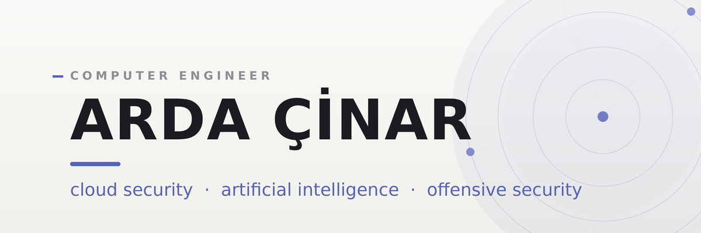

### Hi, I'm Arda

I'm a computer engineering student working at the intersection of **cloud security, AI and offensive security** — building everything from autonomous threat-detection systems on AWS to deep-learning models trained on satellite imagery. I was selected into Türkiye's **TSGK Cloud Security Team** through national CTF, and I lead my university's cybersecurity community.

I care about clean infrastructure, least-privilege design, and breaking systems before someone else does.

### Find me around the web

- Writing and projects on my [website](https://ardacinar.net/)
- Connecting on [LinkedIn](https://www.linkedin.com/in/arda-çinar-092bb7295)
- Notes and articles on [Medium](https://medium.com/@cinar0arda)
- Reach me by [email](mailto:arda@ardacinar.net)

### Selected work

- [**autonomous-ai-soc**](https://github.com/Artupak/autonomous-ai-soc) — an autonomous SOC engine that detects anomalies in AWS CloudTrail logs with an LSTM Autoencoder and responds to threats on its own.
- [**serverless-guestbook-api**](https://github.com/Artupak/serverless-guestbook-api) — a fully serverless API built as infrastructure-as-code with AWS SAM, Lambda, API Gateway and DynamoDB.
- [**redteamtool**](https://github.com/Artupak/redteamtool) — a modular red-team framework spanning reconnaissance, phishing simulation, privilege escalation and lateral movement.
- [**rest-detector-agent**](https://github.com/Artupak/rest-detector-agent) — real-time object detection and face analysis with YOLOv8 and DeepFace, tuned for CUDA and Apple Silicon.
